<div align="center">



</div>

## `vipul@github:~$ ls ~/stack`

```text
backend/        Python · FastAPI · Django · Flask · SQLAlchemy
systems/        Linux · Processes · Sockets · Networking
infrastructure/ Docker · Redis · RabbitMQ · PostgreSQL · Git
ai/             RAG · LLM APIs · LangChain · Vector Databases
```

## `vipul@github:~$ cat ~/projects/logalyser/README`

```text
Logalyser
─────────
A log monitoring and incident analysis system built around independent
watcher processes and an event-driven backend.

Configured watchers monitor files and directories as separate processes
and publish events through Redis Streams. Workers consume those events
without coupling monitoring work to the API server.

FastAPI and SQLAlchemy provide the management layer, with PostgreSQL and
Alembic handling persistent watcher configuration and schema migrations.
A React Native frontend provides a view into watchers and their events.

Stack: Python · FastAPI · SQLAlchemy · PostgreSQL · Alembic · Redis · Docker
```

## `vipul@github:~$ cat ~/projects/linkedin-handler/README`

```text
LinkedIn Handler
────────────────
A developer activity pipeline that watches source repositories and turns
meaningful code changes into material for technical LinkedIn posts.

It observes filesystem changes, aggregates multi-file Git diffs and feeds
those changes into an LLM-assisted analysis pipeline before generating a
human-readable explanation of what changed and why it matters.

Stack: Python · Git · Watchdog · LLM APIs
```

## `vipul@github:~$ cat ~/projects/async-worker-lab/README`

```text
Async Worker Lab
────────────────
A small FastAPI and Celery environment I use to explore background jobs,
message brokers, asynchronous execution and worker-based architectures.

The project runs FastAPI, Celery and Redis as separate services with Docker,
letting me experiment with task dispatch, result backends and worker lifecycle.

Stack: Python · FastAPI · Celery · Redis · Docker
```

## `vipul@github:~$ cat ~/about`

```text
Interested in backend systems, Linux, networking and distributed systems.
I like building things that make me look underneath the abstraction instead
of only using it.

Current focus: Logalyser
Editor:        Neovim
Environment:   Linux
```

## `vipul@github:~$ git log --oneline --life`

```text
a8f3c21  learning distributed systems
72ac891  building backend systems
19df420  discovered containers
4bb01ca  started living in the terminal
0000001  hello world
```

## `vipul@github:~$ echo $CURRENT_GOAL`

```text
Build better backend systems.
Understand what's happening underneath the abstractions.
Ship useful software.
```

<div align="center">

`vipul@github:~$ █`

</div>
